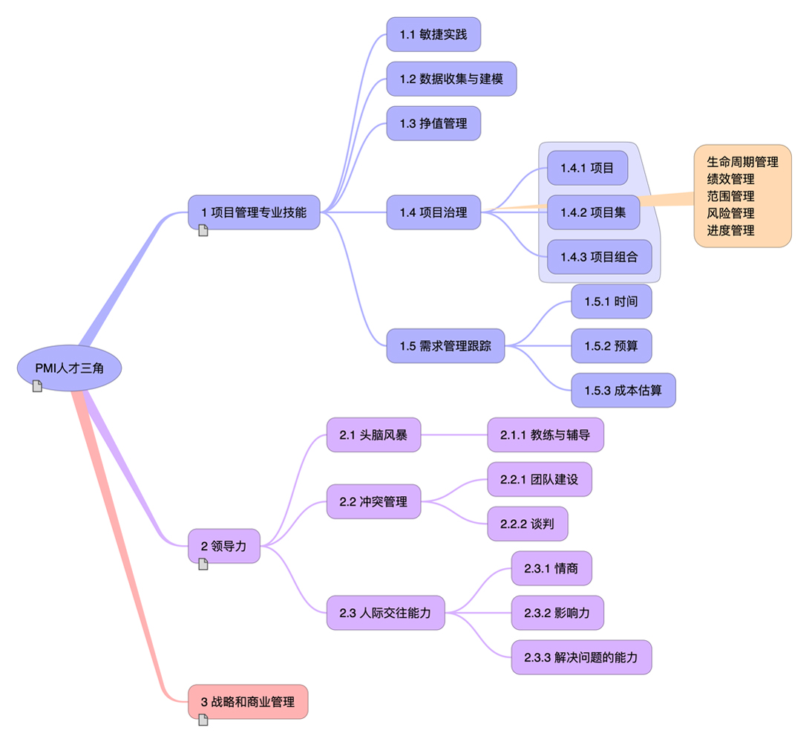

# PMP 项目经理良好实践
> 卢珑文项目经理，全栈工程师，营销管理实践，PMI人才三角
* 产品经理的思维方式，构架师一样具有全局观
* 全能管理者
  * 除了能够熟练应用项目管理中传统的瀑布法外，
  * 项目经理还要学会应用不断涌现的新方法。
* 

## PMI人才三角
1. 项目管理专业技能
  * 与项目、项目集和项目组合管理特定领域相关的专门领域知识、技能
  * 数字时代，项目经理的角色已经拓展为：战略顾问、创新者、沟通专家、思维敏捷的全能型管理者，
  * 项目管理的角色有着多重维度的提升。
2. 领导力
  * 指导、激励和带领团队所需的知识、技能和行为，可帮助组织达成业务目标。
3. 战略和商业管理
  * 商业导向技能，关于行业和组织的知识和专业技能，有助于提高绩效并取得更好的业务成果。

## 卢珑文的项目经理进阶
* 看了不一定重视，不重视，不实践就没有用
* [流程参考模板](http://www.sohu.com/a/215215675_642761)

## [PMBOK](PMBOK/PMP.md)
* 五大过程组
  * 启动，规划，执行，监控，收尾

* 十大知识领域
  * 整合管理，范围管理，时间管理，成本管理
  * 质量管理，人力资源管理，沟通管理，风险管理
  * 采购管理，相关方管理

* 输入，工具，输出

## 如何解决问题
发现问题
分析问题
解决问题

* 职业道德
  责任
  尊重
  公正
  真诚

## 1 启动过程组
* 设立目标，让项目团队有事可做

## 2 规划过程组
* 指定工作路线，让项目有法可依

## 3 执行过程组
* 按图索骥，让项目有法必依

## 4 监控过程组
* 车辆项目绩效

## 5 收尾过程组
* 相关方满意度，项目闭环，项目做得圆满

## PMP相关管理理念
1. ACP
	* Agile Certified Practitioner
	* AGILE 敏捷项目管理人士资格认证

2. PGMP
	* Program Management Professional
	* 项目集管理认证

3. PMP
	* Project Management Institute
	* 项目管理专业人士资格认证

4. NPDP
	* 产品经理国际资格认证

5. PBA 
	* 商业分析师 

## 圈子营销

## 微信营销
